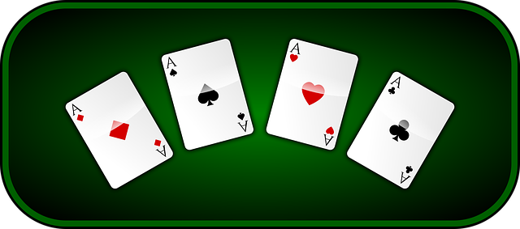
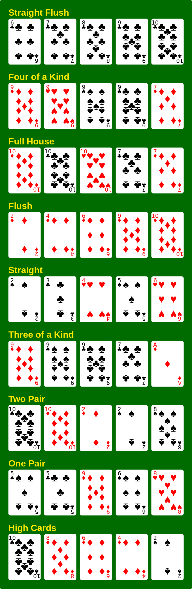

# Poker hands kata

The goal of this kata is to determine the best hand out of a set of hands
containing a set of poker cards (i.e. 5 cards).

This is a TDD version of the course [Design of Computer Programs](https://www.udacity.com/course/design-of-computer-programs--cs212). The approach is outside-in, also known as the [London school of TDD](https://blog.devgenius.io/detroit-and-london-schools-of-test-driven-development-3d2f8dca71e5) approach.

The essence is to work our way from the outside inwards. So we start with a function to pick the winning hand amoung a set of hands, mocking the ranking function we need to make this happen. Next we implement the ranking of a hand, mocking all the functions we need to make that happen, etc. This way, our design will benefit from this approach, as we will see. 

Refer also to [Test-Driven Development With Python: An Introduction to Mocking](https://medium.com/geekculture/test-driven-development-with-python-an-introduction-to-mocking-8ab6c1fe1c83).

## Rules

Poker is played according to the following rules:



[Source: Door Sissyneck op de Engelstalige Wikipedia, CC BY-SA 3.0](https://commons.wikimedia.org/w/index.php?curid=12387417)

# Implementation

Before we start with the implementation, let's first consider a couple of design decisions that we would otherwise would have to make along the way.

## Design considerations

First, let's map all cards to integers: 
- 2 &rarr; 2, 
- 3 &rarr; 3, 
- ..., 
- jack &rarr; 11, 
- queen &rarr; 12, 
- king &rarr; 13, 
- ace &rarr; 14.

An obvious way to rank poker hands would be to map the above sets to integer values, the lowest value, zero, to represent high cards and the highest integer value eight representing straight flush. 

Suppose e.g. one hand to contain "9 9 9 9 5" and the other "3 3 3 3 2". As is argued in [the course]([Design of Computer Programs](https://www.udacity.com/course/design-of-computer-programs--cs212)), the best way to represent the ranking is to use tuples, where we have the added benefit of Python being able to compare such tuples by default, e.g. `(7, 9, 5) > (7, 3, 2)`.

So for example a hand containing (where suits have been omitted):
- "9 9 9 9 5" &rarr; _(7, 9, 5)_
- "3 3 3 3 2" &rarr; _(7, 3, 2)_
- "11 10 9 8 7" & same suit &rarr; _(8, 11)_
- "14 14 14 14 12" &rarr; _(7, 14, 12)_
- "8 8 8 13 13" &rarr; _(6, 8, 13)_
- "10 8 7 5 3" & same suit &rarr; _(5, [10, 8, 7, 5, 3])_
- "11 10 9 8 7" &rarr; _(4, 11)_
- "7 7 7 5 2" &rarr; _(3, 7, [7, 7, 7, 5, 2])_
- "11, 11, 3, 3, 13" &rarr; _(2,, 11, 3, [13, 11, 11, 3, 3])_
- "2 2 11 6 3" &rarr; _(1, 2, [11, 6, 3, 2, 2])_
- "7 5 4 3 2" &rarr; _(0, 7, 5, 4, 3, 2)_


## Behaviour on empty set of hands

We start by defining the behaviour for an empty set of hands.
```python
with description('Given an empty set of hands'):
  with it('raises an exception'):
    expect(lambda: determine_best_hand([])) \
      .to(raise_error(IllegalArgumentsException))
```

This is implemented by
```python
def determine_best_hand(hands):
  if len(hands) == 0:
    raise IllegalArgumentsException()
```

and defining the `IllegalArgumentsException`
```python
class IllegalArgumentsException(Exception):
    pass
```

## Behaviour on a set consisting of a single hand

Let's define the behaviour for a single hand:
```python
straight_flush = Hand("6C 7C 8C 9C T9".split())

...
with description('Given a set of one hand'):
  with it('returns the one and only hand as winner'):
    hands = [straight_flush]
    expect(determine_best_hand(hands)).to(equal(straight_flush))```

This is implemented by
```python
def determine_best_hand(hands):
  if len(hands) == 0:
    raise IllegalArgumentsException()
  elif len(hands) == 1:
    return hands[0]
```

and a `Hand` class
```python
class Hand:
  def __init__(self, cards):
    self.cards = cards
```

## Two hands

Let's assume two hands, one containing a straight flush and the other containing a full house (how to deal with breaking ties is still too complicated at this point):

```python
full_house = Hand("TD TC TH 7C 7D".split())

with description('Given full house versus straight flush') as self:
  with it('returns the straight flush hand'):
    hands = [full_house, straight_flush]
    expect(determine_best_hand(hands)).to(equal(straight_flush))
```

This can be implemented by always returning the second hand: 

```python
def determine_best_hand(hands):
  ...  
  return hands[1]
```

Obviously, we want to enforce some ranking mechanism, so we introduce yet another test, which is the same as the previous test, but now the order reversed:

```python
with description('Given straight flush versus full house') as self:
  with it('returns the straight flush hand'):
    hands = [straight_flush, full_house]
    expect(determine_best_hand(hands)).to(equal(straight_flush))
```

We have to generalize the `determine_best_hand()` method
```python
def rank_hand(hand):
  return hand.rank()
  
def determine_best_hand(hands):
  if len(hands) == 0:
    raise IllegalArgumentsException()
  elif len(hands) == 1:
    return hands[0]
  
  return max(hands, key = rank_hand)
```

where we assume a `rank_hand()` function to rank the hands and mocking the `rank_hand()` call for now

```python
when(poker_hands).rank_hand(full_house).thenReturn(PokerRanks.FULL_HOUSE.value)
when(poker_hands).rank_hand(straight_flush).thenReturn(PokerRanks.STRAIGHT_FLUSH.value)
```

## Implementing the hand ranking

Let's create a separate specification for the `Hand` class (`hand_spec.py`)

```python
with description('Given a hand with straight') as self:
    with it('ranks the hand as straight'):
      expect(ace_5_staight.rank()).to(equal(PokerRanks.STRAIGHT))
```
which can easily be made green by

```python
class Hand:
  def __init__(self, cards):
    self.cards = cards

  def rank(self) -> PokerRanks:
    return PokerRanks.FULL_HOUSE
```
So we have to add yet another test case

```python
with description('Given a hand with flush') as self:
    with it('ranks the hand as flush'):
      ...
      expect(flush.rank()).to(equal(PokerRanks.FLUSH))
```

where we have modified the `Hand` class

```python
  def straight(self):
    pass

  def rank(self) -> PokerRanks:
    if self.straight():
      return PokerRanks.STRAIGHT
    return PokerRanks.FLUSH
```

Now make these scenarios and production code complete by mocking the `straight()` function (like we did in the `PokerHands` specification) and letting the `rank_hand(hand)` function return the value of the enum.

### Straight flush

Now let us continue specifying the highest ranking, straigt flush, which obviously is a combination of straight and flush:

```python
with description('Given a hand with straight flush') as self:
    with it('ranks the hand as straight flush'):
      when(Hand).straight().thenReturn(True)
      when(Hand).flush().thenReturn(True)
      expect(straight_flush.rank()).to(equal(PokerRanks.STRAIGHT_FLUSH))
```

Complete the production code to make the test green. Is there anything we can refactor (DRY)? Make it so!

### Four of a kind

As is implied by the names of `PokerRanks` enum values, there are various "of-a-kind" types: one of a kind, two of a kind, three of a kind, and four of a kind. This strongly suggests a `kind(self, kind_of:int)` function, that we can use to implement the next scenario, namely four of a kind (where the `kind_of` parameter equals four):

```python
...
with context('Given a hand with four of a kind') as self:
    with it('ranks the hand as four of a kind'):
      ...
      expect(four_of_a_kind.rank()).to(equal(PokerRanks.FOUR_OF_A_KIND))
```

Complete the test and production code.

### Breaking ties

